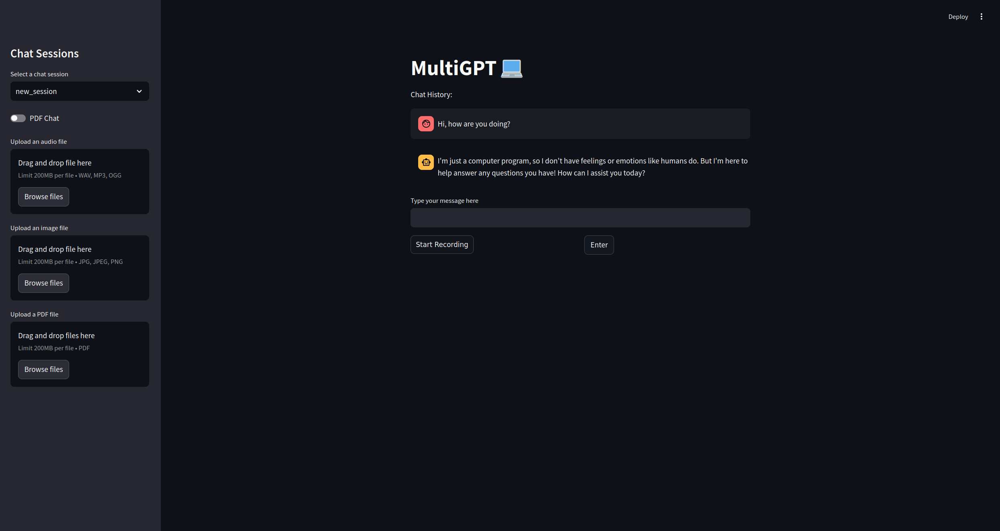

# MultiGPT: Chatbot with Audiochat, Image and PDF Capabilities



## Introduction
MultiGPT is a chatbot designed to run locally on the machine without any API calls to hosted models. All required models
are hosted and run locally on the user machine. MultiGPT offers chat with support to save and load chat sessions, upload
and analyze audio file, upload and analyze image files and upload and analyze PDF files for specific user queries in 
those documents. MultiGPT also supports audio-chat, where the user can ask a question into a microphone.

## Features
:white_check_mark: Chatbot with Mistral-7B LLM model.<br />
:white_check_mark: Image analysis support using Llava model.<br />
:white_check_mark: Audio-chat support using OpenAI whisper model. <br />
:white_check_mark: Analysis of audio files. (MP3, WAV, OGG) <br />
:white_check_mark: RAG (Retrieval-Augmented Generation) implemented to support user queries from PDF documents. <br />
:white_check_mark: Save chat sessions with date and time to enable resumption of chat. <br />
:white_check_mark: Intuitive user interface (UI), using streamlit. <br />

## Installation
We recommend using Conda, but you can use any virtual environment of your choice.
If you use Conda, create a new environment with:

```bash 
conda create -n multigptenv python=3.11
conda activate multigptenv
pip install -r requirements.txt
```

## Usage
Run the following command to start the MultiGPT UI in a browser:

```bash 
streamlit run app.py
```